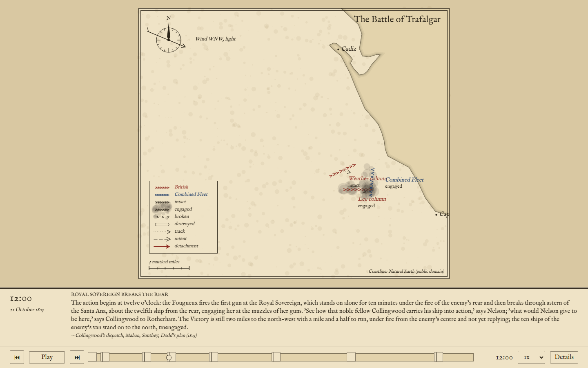

# Sandtable

Sandtable plays back famous battles as animated 2D "grand strategy" sequences: a map, its units and their moves, a caption band and play/pause/scrub controls, driven by a reusable JSON timeline format whose timelines are extracted from public-domain primary and secondary sources. It is not a game and not 3D. It is a data-driven animation player where the interesting work is the data, and the bar is a documentary map with arrows, drawn here as an engraved chart plate. The concept in full is [`docs/CONCEPT.md`](docs/CONCEPT.md).

It is live at **https://nullcoderexception.github.io/sandtable/**, and a battle is addressed by name on the query string: [`?battle=trafalgar`](https://nullcoderexception.github.io/sandtable/?battle=trafalgar).

v0.1 plays the Battle of Trafalgar at three-unit granularity: Nelson's weather column, Collingwood's lee column and the Combined Fleet, from the dawn sighting to the last shots.



## Running it

Needs Node 22 or later.

```sh
npm install        # once
npm run dev        # dev server with hot reload on http://localhost:5173
npm run build      # production build into dist/
npm run preview    # serve the production build locally
npm test           # Vitest, once
npm run typecheck  # tsc over the app, the Vite config and the scripts
npm run validate   # check data/ against schema v2 (or: npm run validate data/battles/x.json)
```

Open the dev server's URL and Trafalgar loads, paused on the dawn phase. Space plays and pauses, the arrow keys jump a phase, the scrubber scrubs, and the "Details" button opens the phase notes and the sources table.

CI (`.github/workflows/ci.yml`) runs `npm ci`, `typecheck`, `test`, `validate` and `build` on every pull request and on `main`, so a broken data file fails the pipeline, and checks that a PR's title is a conventional commit line. A second workflow (`.github/workflows/pages.yml`) builds with Vite and publishes to GitHub Pages on every push to `main`; Pages serves the site under the repository path, which is why `vite.config.ts` sets `base` to `/sandtable/` for the build, and for `npm run preview` so the built site can be checked locally the way it is hosted. `npm run dev` is unaffected and still serves from the root. Changes reach `main` only through squash-merged pull requests; see [`docs/agents/git-workflow.md`](docs/agents/git-workflow.md).

## Adding a battle

1. Write `data/battles/<name>.json` following [`docs/schema.md`](docs/schema.md). `data/battles/trafalgar.json` is the worked example.
2. If the battle plays over a coastline, add `data/maps/<name>.geojson` and set the battle's `map` field to that bare name. The map is a GeoJSON `FeatureCollection` with its own `license` and `attribution` members, holding six kinds of feature: `land` and `shoal` as polygons, `river` and `contour` as lines, `place` and `work` as points.
3. Run `npm run validate`. It reports every error with the file and the JSON-pointer path of the offending value, and exits 1 if there is any.
4. Open `http://localhost:5173/?battle=<name>`. The app fetches the battle, validates it in the browser too, follows its `map`, and plays it; if the file cannot be fetched or fails validation, the errors are drawn on the plate instead, file, path and message as the command line prints them, and logged to the console.

The design decisions behind the format and the renderer are recorded as ADRs in [`docs/adr/`](docs/adr/): real lat/lon coordinates, phases as snapshots tweened by the player, authored state and strength rather than simulated casualties, moves as authored arrows, the referenced GeoJSON map, one caption per phase with a sources table, the data licence, wind as direction and force, the engraved chart plate, and the schema v1 lock.

## Licences

- **Code** is MIT ([`LICENSE`](LICENSE)).
- **Battle files** under `data/battles/` are CC BY 4.0; each file's `license` and `attribution` fields are authoritative, and battle files draw only on public-domain or attribution-only sources, never share-alike ones (ADR-0007).
- **Map files** under `data/maps/` each declare their own licence in the file's `license` member, with the credit line in `attribution`. The Cadiz coast is cut from Natural Earth, public domain.

The full statement is [`data/LICENSE`](data/LICENSE). The plate typeface, IM Fell English, is under the SIL Open Font License 1.1 (`src/fonts/OFL.txt`).

## How it is put together

- `src/schema/` is schema v2 in code: `types.ts` is the source of truth for both file kinds, `licenses.ts` the licence allowlist, `arms.ts` the arm allowlist, `hierarchy.ts` the roster tree and the units a level draws, `validateBattle.ts` and `validateMap.ts` the runtime validators. They never throw; they return every error with a JSON-pointer path. `docs/schema.md` is the prose copy, kept in step.
- `src/timeline/` turns a battle and a battle-clock instant into a `Picture`: which phase, every unit's tweened position and heading, stepped formation and state, and the phase's caption.
- `src/render/` draws a `Picture` on a Canvas as the chart plate: parchment, Web Mercator projection, coastline, ship-tick glyphs, tracks and move arrows, compass rose with the wind, scale bar, legend and caption band.
- `src/player/` is the animation loop and the controls beneath the plate; every rule about what a control does lives in `state.ts` and is tested without a browser.
- `src/app/` loads a battle by name (`loadBattle.ts`), reads `?battle=` (`battleName.ts`) and paints the loading and error plates (`notice.ts`); `src/main.ts` wires them together.
- `src/data/paths.ts` is the only module that knows where data lives: `<base>data/battles/<name>.json` and `<base>data/maps/<name>.geojson`, where `<base>` is the app's base URL, `/` on the dev server and `/sandtable/` on Pages. A small Vite plugin, `vite/serve-data.ts`, serves the repo's `data/` directory at that prefix in dev (a plain 404 for anything missing, never the HTML fallback) and copies it into `dist/data/` in the build, because Vite's `publicDir` cannot mount a directory under a prefix. A static host serves the same URLs for the files that exist; what it returns for a missing one is its own fallback behaviour, so a battle that is not there may read as "not valid JSON" rather than a 404.
- `scripts/validate.ts` is `npm run validate`. It runs on Node's built-in type stripping, which is why imports inside `src/schema/` spell out their `.ts` extension.
- `src/fonts/plate.ts` loads the bundled typeface as a `FontFace` before the first frame, because Canvas text falls back silently if the face is not ready.
