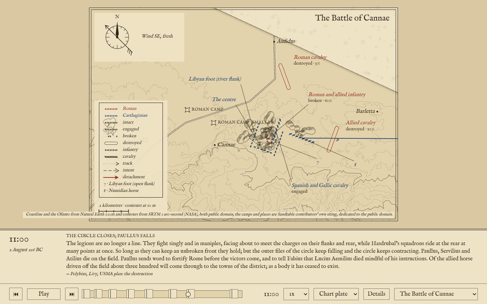

# Marchpast

Marchpast plays back famous battles as animated 2D "grand strategy" sequences: a map, its units and their moves, a caption band and play/pause/scrub controls. It is not a game and not 3D. The bar is a documentary map with arrows, drawn here as an engraved chart plate. It is driven by a reusable JSON timeline format whose timelines are extracted from public-domain primary and secondary sources: a data-driven animation player where the interesting work is the data. The concept in full is [`docs/CONCEPT.md`](docs/CONCEPT.md).

It is live at **https://marchpast.com/**. The bare URL is the library: every battle it holds, oldest first, with its date and the sentence it describes itself by. A battle is addressed by name on the query string, [`?battle=trafalgar`](https://marchpast.com/?battle=trafalgar), and the player's picker switches to another one. There is no default battle and the site remembers nothing (ADR-0011).

v0.2 holds four battles. Cannae (216 BC) is the land battle: the Roman army and Hannibal's wings drawn as wings, foot and horse with different signs, over a map with the Aufidus, the two Roman camps and the hill in contours. The Nile (1798) is fought squadron by squadron across midnight, over the Aboukir shoal, and its date advances with the clock. Copenhagen (1801) plays as Nelson's and Parker's divisions and the Danish line, up the King's Deep past the Middle Ground and the Trekroner. Trafalgar (1805) is authored at two levels, three columns or their squadrons, and the viewer picks which the plate draws. Every battle plays in three views: the Chart plate, the default; the Night plate, the same plate inverted, parchment ink on an indigo ground; and the Atlas, units as blocks with strength as the filled fraction and the arrows thickened. Any unit's label unfolds into a card. On a phone the plate, the caption band and the furniture collapse to fit.



## Running it

Needs Node 22 or later.

```sh
npm install        # once
npm run dev        # dev server with hot reload on http://localhost:5173
npm run build      # production build into dist/
npm run preview    # serve the production build locally
npm test           # Vitest, once
npm run typecheck  # tsc over the app, the Vite config and the scripts
npm run validate   # check data/ against schema v2 (or: npm run validate data/battles/x.json)
```

Open the dev server's URL and the library lists what it holds; click a battle and it loads, paused on its first phase, in the Chart plate at the coarsest level. Space plays and pauses, the arrow keys jump a phase, the scrubber scrubs. Along the strip after the speed multiplier are the View chooser, the Level chooser when the battle has more than one level (Trafalgar), the "Details" button that opens the phase notes and the sources table, and the picker that leaves for another battle. Switching the view or the level takes effect on the next frame and interrupts nothing. Resting the pointer on a unit's glyph or its label opens the unit card; a click pins it, a click on bare plate closes it, and a click on the legend's numeral row opens the card of a unit whose label has collapsed to a numeral.

CI (`.github/workflows/ci.yml`) runs `npm ci`, `typecheck`, `test`, `validate` and `build` on every pull request and on `main`, so a broken data file fails the pipeline, and checks that a PR's title is a conventional commit line. A second workflow (`.github/workflows/pages.yml`) builds with Vite and publishes to GitHub Pages on every push to `main`; Pages serves the site from the root of its own domain, `marchpast.com`, so `vite.config.ts` sets no `base` and the dev server, the build and `npm run preview` all serve from the root alike. Changes reach `main` only through squash-merged pull requests; see [`docs/agents/git-workflow.md`](docs/agents/git-workflow.md).

## Adding a battle

1. Write `data/battles/<name>.json` following [`docs/schema.md`](docs/schema.md), which is schema v2. `data/battles/trafalgar.json` is the worked example at sea and `data/battles/cannae.json` the one on land. Beside the title, a battle carries `summary`, the one sentence the library and the picker show; `dates`, one display string per day it spans; and `sort_date`, the first day as numbers, the year negative before Christ, which is all the library orders by. Every unit on the roster carries an `arm`, `infantry`, `cavalry` or `ship`, which decides the sign each view draws it with. A roster may be a tree: a unit names its `parent`, and the battle then names its `levels`, coarsest first, for the Level chooser. Every unit has a snapshot in every phase whatever level is drawn, and no level may draw more than sixteen units; the validator counts. A phase on a later day carries its `day`, and the battle's `end` its `end_day`, which is how the Nile crosses midnight.
2. If the battle plays over a coastline, or any ground worth drawing, add `data/maps/<name>.geojson` and set the battle's `map` field to that bare name. The map is a GeoJSON `FeatureCollection` with its own `license` and `attribution` members, holding seven kinds of feature: `land` and `shoal` as polygons, `river`, `contour` and `rampart` as lines, `place` and `work` as points. A contour carries its `elevation` in metres and no styling; the renderer derives the interval and picks the index contours itself.
3. Run `npm run validate`. It reports every error with the file and the JSON-pointer path of the offending value, and exits 1 if there is any.
4. Open `http://localhost:5173/`. The library lists the new battle as soon as the file exists: the list is generated from `data/battles/` on every request, so nothing needs restarting and nothing needs editing by hand. Clicking it, or opening `http://localhost:5173/?battle=<name>`, plays it: the app fetches the battle, validates it in the browser too, follows its `map`, and plays it. If the file cannot be fetched or fails validation, the errors are drawn on the plate instead, file, path and message as the command line prints them, logged to the console, and the plate gains a link back to the library.

The design decisions behind the format and the renderer are recorded as ADRs in [`docs/adr/`](docs/adr/): real lat/lon coordinates, phases as snapshots tweened by the player, authored state and strength rather than simulated casualties, moves as authored arrows, the referenced GeoJSON map, one caption per phase with a sources table, the data licence, wind as direction and force, the engraved chart plate, the schema v1 lock, the library built from the battle files, the map format's rivers, shoals, works and contours, the battle clock across midnight, the views with the chart plate as the default, an arm on every unit and a sign for it in every view, land units as ranks of signs with formation gaining mass, hierarchy authored at every level with the viewer picking the level, the v1 states and moves kept for Cannae with `broken` widened, and anchoring and the truce as caption matter with heading as the fighting front (ADR-0001 to ADR-0019).

## Licences

- **Code** is MIT ([`LICENSE`](LICENSE)).
- **Battle files** under `data/battles/` are CC BY 4.0; each file's `license` and `attribution` fields are authoritative, and battle files draw only on public-domain or attribution-only sources, never share-alike ones (ADR-0007).
- **Map files** under `data/maps/` each declare their own licence in the file's `license` member, with the credit line in `attribution`. The Cadiz coast is cut from Natural Earth, public domain, and the Cannae map adds contours from SRTM 1 arc-second, also public domain. The Aboukir and Copenhagen maps put Natural Earth's coast under shoals and shorelines traced by Marchpast contributors from period plans, and are CC BY 4.0.

The full statement is [`data/LICENSE`](data/LICENSE). The plate typeface, IM Fell English, is under the SIL Open Font License 1.1 (`src/fonts/OFL.txt`).

## How it is put together

- `src/schema/` is schema v2 in code: `types.ts` is the source of truth for both file kinds, `licenses.ts` the licence allowlist, `arms.ts` the arm allowlist, `hierarchy.ts` the roster tree and the units a level draws, `validateBattle.ts` and `validateMap.ts` the runtime validators. They never throw; they return every error with a JSON-pointer path. `docs/schema.md` is the prose copy, kept in step.
- `src/timeline/` turns a battle and a battle-clock instant into a `Picture`: which phase, every unit's tweened position and heading, stepped formation and state, and the phase's caption. The clock counts from midnight of the first day, so a battle that crosses midnight stays one monotonic line and the caption band shows the day's date.
- `src/render/` draws a `Picture` on a Canvas. `view.ts` is the seam a view hangs off, a palette, three pens and one glyph pass over the shared passes, and `views.ts` the three views there are. `level.ts` narrows the picture to the units the chosen level draws, and does nothing else. `drawMap.ts` with `relief.ts` draws the land, rivers, shoals, works and contours; `drawUnits.ts` and `glyphs/` draw a sign per arm per view, in file, abreast or in ranks; `labels/` is the label placer, a sticky search over boxes that displaces, collapses and leads each label, places the map's names first as obstacles, and unfolds one label into the unit card; `drawFurniture.ts` and `scaleBar.ts` are the compass rose with the wind, the legend and the scale bar; `drawCaption.ts` the band beneath. `layout.ts` is where the phone layout is decided, once. `render` hands back the frame's hit regions, `hit.ts`, so the player can turn a pointer into a unit.
- `src/player/` is the animation loop and the controls beneath the plate, the View and Level choosers and the picker among them, and the pointer rules that open, pin and close the unit card; every rule about what a control does lives in `state.ts` and is tested without a browser.
- `src/app/` loads a battle by name (`loadBattle.ts`) and the library (`loadLibrary.ts`), both over the one fetch and the one error report in `load.ts`; it reads `?battle=` (`battleName.ts`), draws the library page (`libraryPage.ts`, the only part of the site that is DOM rather than canvas, because a list has nothing to animate) and paints the loading and error plates (`notice.ts`). `src/main.ts` decides between the two pages and wires whichever it is together.
- `src/data/paths.ts` is the only module that knows where data lives: `<base>data/battles/<name>.json` and `<base>data/maps/<name>.geojson`, where `<base>` is the app's base URL, a bare `/` on the dev server and on the live site alike. A small Vite plugin, `vite/serve-data.ts`, serves the repo's `data/` directory at that prefix in dev (a plain 404 for anything missing, never the HTML fallback) and copies it into `dist/data/` in the build, because Vite's `publicDir` cannot mount a directory under a prefix. A static host serves the same URLs for the files that exist; what it returns for a missing one is its own fallback behaviour, so a battle that is not there may read as "not valid JSON" rather than a 404. One file on that route is on no one's disk: `data/index.json` is the library, built from the battle files themselves by `vite/library.ts` over the shape in `src/data/library.ts`: name, title, `dates[0]`, `sort_date`, `summary` and the sides, sorted oldest first. The same `serveData` plugin writes it into `dist/data/` in the build and generates it per request in dev; it is never committed, and a battle file that fails validation fails the build rather than dropping out of the library.
- `scripts/validate.ts` is `npm run validate`. It runs on Node's built-in type stripping, which is why imports inside `src/schema/` spell out their `.ts` extension.
- `src/fonts/plate.ts` loads the bundled typeface as a `FontFace` before the first frame, because Canvas text falls back silently if the face is not ready.
