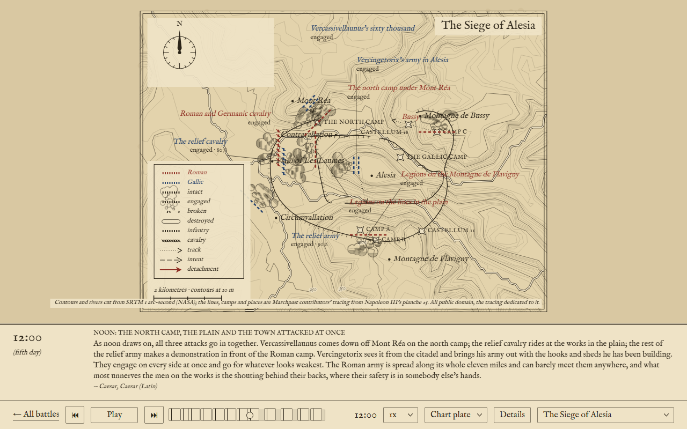
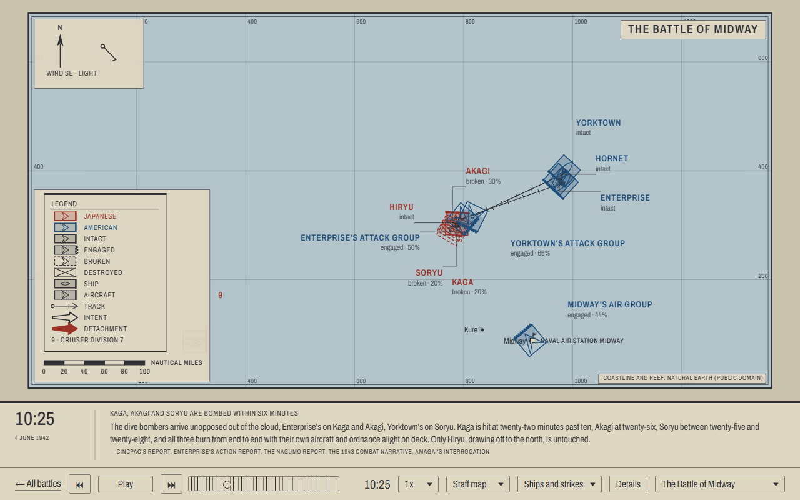

# Marchpast

Open a battle and you get a map, the armies or fleets drawn on it in the signs of an engraved chart, a caption saying what is happening, and a clock. Press play. The units move, break and go under, and the caption band keeps pace.

That is the whole product. A famous battle played back as an animated 2D "grand strategy" sequence, with play, pause and scrub. Not a game and not 3D. The bar is a documentary map with arrows. Every battle is a JSON file of phases extracted from public-domain sources, and the renderer knows nothing about any particular one, so the interesting work is the data. [`docs/CONCEPT.md`](docs/CONCEPT.md) makes the case at length.

It is live at **https://marchpast.com/**.



## The site

The bare URL is the library. It lists every battle oldest first, each with a still the build renders, its date, its two sides and the sentence it describes itself by, hung off a chronology rail that writes the gap from one battle to the next in words. A battle then has a page of its own at its own path, [`/trafalgar/`](https://marchpast.com/trafalgar/), carrying that battle's title, description and social card rather than the site's.

The picker in the control strip switches to another battle, and `← All battles` at the head of the strip goes back. The old `?battle=trafalgar` form is still read and rewritten to the path. A name the site does not hold gets a 404 on parchment. There is no default battle and no battle is remembered (ADR-0011). The view is (ADR-0023).

## The battles

Seven, across two millennia. Each was picked for something it makes the format do.

- **Cannae**, 2 August 216 BC. The first land battle. Wings, foot and horse take different signs, over a map with the Aufidus, the two Roman camps and the hill in contours.
- **Alesia**, September 52 BC. The siege. Caesar's contravallation and circumvallation are drawn as ramparts, the relief army and the besieged go at them together, and six days play out sector by sector along both lines. One of those days is quiet.
- **The Nile**, 1 August 1798. Fought squadron by squadron across midnight. The clock runs past 00:00 in one line and the date in the caption band advances under it.
- **Copenhagen**, 2 April 1801. Nelson's and Parker's divisions against the Danish line, up the King's Deep past the Middle Ground and the Trekroner.
- **Trafalgar**, 21 October 1805. Authored at two levels, three columns or their squadrons, and the viewer picks which the plate draws.
- **The Little Bighorn**, 25 June 1876. Commands or their wings, over the river and the bluffs. Where the accounts conflict the plate draws one reading and the notes say which and why.
- **Midway**, 4 June 1942. Aircraft as an arm, strikes as units in their own right, a plate spanning the 180th meridian, and units absent from a phase, because a strike that has not launched is not anywhere yet.

## The four views

Every battle plays in all four, and the viewer is the only thing that picks one.

- **Chart plate**, the default. Engraved ink on parchment.
- **Night plate**. The same plate inverted, parchment ink on an indigo ground.
- **Atlas**. Units as blocks, strength as the filled fraction, the arrows thickened.
- **Staff map**. A printed twentieth-century operations sheet, each unit framed to its own frontage over a kilometre graticule, with tapered broad arrows for its moves.

The surface follows the picture. The strip, the caption band and the details panel take the view's ink and ground, so the Night plate is a dark page and the Staff map a printed one. That choice is remembered for the next visit, and nothing else about a visit is. On a phone the plate, the caption band and the furniture collapse to fit.



## Running it

Needs Node 22 or later.

```sh
npm install        # once
npm run dev        # dev server with hot reload on http://localhost:5173
npm run build      # production build into dist/
npm run preview    # serve the production build locally
npm test           # Vitest, once
npm run typecheck  # tsc over the app, the Vite config and the scripts
npm run validate   # check data/ against schema v2 (or: npm run validate data/battles/x.json)
```

The dev server's URL opens the library. Click a battle and it loads paused on its first phase, at the coarsest level, in the Chart plate or in whichever view the last visit left. Space plays and pauses. The arrow keys jump a phase, which cuts rather than tweens. The scrubber has one segment per phase, sized by how long that phase takes to play.

After the speed multiplier the strip carries the View chooser, the Level chooser, a Details button for the phase notes and the sources table, and the picker. The Level chooser appears only for a battle with more than one level, so Trafalgar, the Little Bighorn and Midway. Switching view or level takes effect on the next frame and interrupts nothing.

Pointer and keyboard both reach a unit. Resting the pointer on a glyph or a label opens that unit's card, a click pins it, and a click on bare plate closes it. Where a label has collapsed to a numeral, its card opens from that numeral's row in the legend. One tab stop after the canvas is the muster, the units the plate is drawing right now as a list: the arrows walk it, Home and End hit the ends, focus opens a card and Enter pins it. A single live region says which phase of how many is showing, and says it again at each phase change, never while the clock runs.

`.github/workflows/ci.yml` runs `npm ci`, `typecheck`, `test`, `validate` and `build` on every pull request and on `main`, so a broken data file fails the pipeline. It also checks that the PR title is a conventional commit line, because that title becomes the commit on `main`. `.github/workflows/pages.yml` repeats those checks and publishes to GitHub Pages on every push to `main`. Pages serves the site from the root of its own domain, so `vite.config.ts` sets no `base` and the dev server, the build and `npm run preview` all serve from the root alike. Changes reach `main` only as squash-merged pull requests; see [`docs/agents/git-workflow.md`](docs/agents/git-workflow.md).

## Adding a battle

**1. Write `data/battles/<name>.json`.** [`docs/schema.md`](docs/schema.md) is the spec, schema v2. `data/battles/trafalgar.json` is the worked example at sea and `data/battles/cannae.json` the one on land.

Beside the title, a battle carries `summary`, the one sentence the library and the picker show; `dates`, one display string per day it spans; and `sort_date`, the first day as numbers with the year negative before Christ, which is all the library orders by. Every unit carries an `arm`, one of `infantry`, `cavalry`, `ship` or `aircraft`, and the arm decides the sign each view draws it with. A roster may be a tree. A unit names its `parent`, the battle names its `levels` coarsest first, and every unit gets a snapshot in every phase it exists in whatever level is drawn. No level may draw more than sixteen units, and the validator counts. A phase on a later day carries its `day`, and the battle's `end` carries `end_day`, which is how the Nile crosses midnight.

**2. Add a map if the battle plays over ground worth drawing.** Put it at `data/maps/<name>.geojson` and name it from the battle's `map` field. It is a GeoJSON `FeatureCollection` with its own `license` and `attribution` members, holding seven kinds of feature: `land` and `shoal` as polygons, `river`, `contour` and `rampart` as lines, `place` and `work` as points. A contour carries its `elevation` in metres and no styling. The renderer derives the interval and picks the index contours itself.

**3. Run `npm run validate`.** Every error comes back with the file and the JSON-pointer path of the offending value, and the exit code is 1 if there is one.

**4. Open `http://localhost:5173/`.** The library lists the new battle as soon as the file exists, because the list is built from `data/battles/` on every request. Nothing to restart, nothing to edit by hand. Click it, or go straight to `/<name>/`, and the app fetches the battle, validates it in the browser too, follows its `map` and plays it. If the file will not fetch or will not validate, the errors are drawn on the plate instead, file, path and message as the command line prints them, with a link back to the library.

## How it is put together

- **`src/schema/`** is schema v2 in code. `types.ts` is the source of truth for both file kinds, with the licence and arm allowlists and the roster tree beside it, and `validateBattle.ts` and `validateMap.ts` doing the runtime checking. The validators never throw. They return every error with a JSON-pointer path. `docs/schema.md` is the prose copy, kept in step.
- **`src/timeline/`** turns a battle and an instant on the battle clock into a `Picture`: which phase it is, every unit's tweened position and heading, its stepped formation and state, and the caption. The clock counts from midnight of the first day, so a battle that crosses midnight stays one monotonic line.
- **`src/render/`** draws a `Picture` on a canvas. `view.ts` is the seam a view hangs off, a palette, pens and five hands, and `views.ts` names the four. `views/` holds the hands themselves, engraved and staff. Everything else is the shared half of a pass, the half that decides where things go rather than how they look. `ground.ts` fixes the order the sea, the land, the relief, the water, the ramparts and the named things are drawn in. `labels/` is a sticky search over boxes that displaces, collapses and leads every label, and unfolds one of them into the unit card. `layout.ts` decides the phone layout once. `hit.ts` hands back the frame's hit regions, so the player can turn a pointer into a unit.
- **`src/player/`** is the animation loop, the controls beneath the plate and the pointer rules that open, pin and close a card. Every rule about what a control does lives in `state.ts` and is tested without a browser. `muster.ts` and `announcer.ts` are the keyboard and screen-reader route to the same plate.
- **`src/app/`** loads a battle (`loadBattle.ts`) and the library (`loadLibrary.ts`) over the one fetch and the one error report in `load.ts`, reads the battle off the path or the legacy query (`battleName.ts`), draws the library page (`libraryPage.ts`) and paints the loading and error plates (`notice.ts`). The library page is the only part of the site that is DOM rather than canvas, because a list has nothing to animate. `src/main.ts` decides which of the two pages this is and wires it up.
- **`src/data/paths.ts`** is the only module that knows where data lives, at `<base>data/battles/<name>.json` and `<base>data/maps/<name>.geojson`, and `<base>` is a bare `/` on the dev server and on the live site alike.
- **`vite/`** is the build's half of that route. `serve-data.ts` mounts `data/` under the prefix, which Vite's `publicDir` cannot do. `library.ts` generates `data/index.json` from the battle files themselves, and `stills.ts` draws each battle's still and social card with the app's own renderer running in Node, from the phase the file marks `still`. All three serve per request in dev and write into `dist/data/` at build, so nothing generated is committed and a battle that fails validation fails the build rather than dropping quietly out of the list. `pages.ts` runs at build only. It writes `dist/<name>/index.html` per battle, the same document over the same bundle with one marked block of the head swapped, while in dev Vite's SPA fallback serves the untransformed page and the app reads the path. `public/404.html` answers for every name the build did not emit.
- **`scripts/validate.ts`** is `npm run validate`. It runs on Node's built-in type stripping, which is why imports inside `src/schema/` spell out their `.ts` extension.
- **`src/fonts/plate.ts`** loads the bundled faces before the first frame, because canvas text falls back silently if the face is not ready.

## Licences

- **Code** is MIT ([`LICENSE`](LICENSE)).
- **Battle files** under `data/battles/` are CC BY 4.0. Each file's `license` and `attribution` fields are authoritative, and a battle draws only on public-domain or attribution-only sources, never share-alike ones (ADR-0007).
- **Map files** under `data/maps/` each declare their own licence in the file, with the credit line in `attribution`. Cadiz is cut from Natural Earth and Cannae adds SRTM 1 arc-second contours, both public domain. Aboukir and Copenhagen put Natural Earth's coast under shoals and shorelines traced by Marchpast contributors from period plans, and are CC BY 4.0. Alesia, the Little Bighorn and Midway are public domain throughout: SRTM contours, Natural Earth's coast and reef, the USGS sheet of 1891 and the National Hydrography Dataset, with the contributors' own tracings and sitings dedicated to the public domain.

The full statement is [`data/LICENSE`](data/LICENSE). Both typefaces, IM Fell English for the plate and Archivo for the staff map, are under the SIL Open Font License 1.1 (`src/fonts/OFL-IMFellEnglish.txt` and `src/fonts/OFL-Archivo.txt`).

## Why it is built this way

Thirty ADRs in [`docs/adr/`](docs/adr/) carry the reasoning. Five of them account for most of what looks odd from outside:

- Positions are real latitude and longitude, from the first battle onward (ADR-0001).
- A phase is a snapshot and the player tweens between two of them. Nothing is simulated (ADR-0002).
- Casualties are authored state and strength, not the output of a combat model (ADR-0003).
- The anatomy is fixed and a view owns the drawing, which is what lets the Staff map be a second aesthetic without a second renderer (ADR-0021).
- The site reads no operating-system preference and the surface declines forced colours. That one is worth reading in full, because the rule is short and the argument is not (ADR-0029).

[`CONTEXT.md`](CONTEXT.md) is the vocabulary. It says what a unit, a phase, a state, a view and a still are, and which nearby words to avoid.
